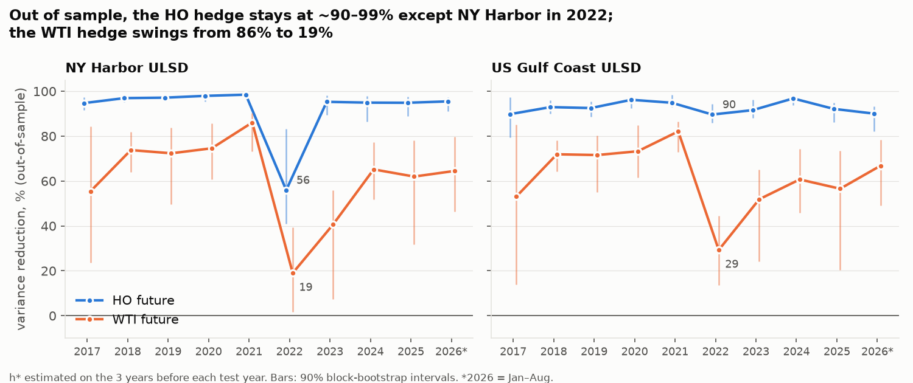
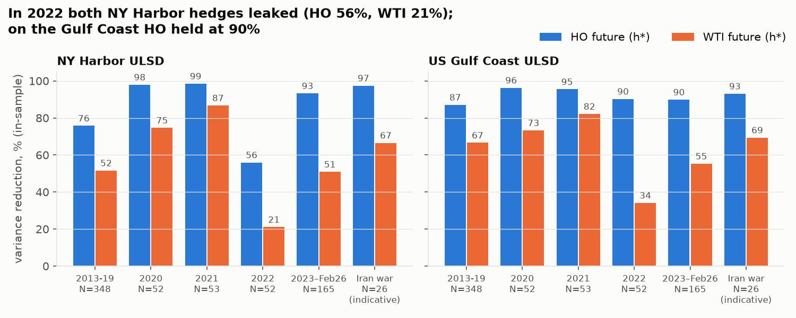
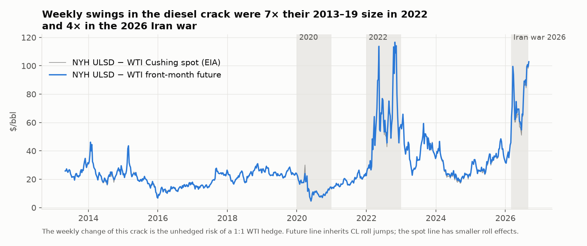

# Basis risk of a physical diesel hedge

**In NY Harbor, hedging physical diesel with crude futures (WTI) removes 41–86% of the weekly price risk in a normal year and only 19% in 2022 (Gulf Coast: 52–82%, 29%). Hedging with diesel futures (HO) removes ~90–99%. The only exception is NY Harbor in 2022, when a few squeeze weeks pulled it down to 56%.**



| Out-of-sample variance reduction | NY Harbor ULSD | US Gulf Coast ULSD |
|---|---|---|
| HO future, 2017–2026 (excl. NYH 2022) | 95–99% | 90–97% |
| WTI future, 2017–2026 (excl. 2022) | 41–86% | 52–82% |
| **2022**: HO / WTI | **56% / 19%** | **90% / 29%** |
| 2020 (COVID, negative WTI): HO / WTI | 98% / 75% | 96% / 73% |
| 2026 Iran war, Mar–Aug (26 weeks, in-sample, indicative): HO / WTI | 97% / 67% | 93% / 69% |

**How to run** (Python 3.14)

```bash
python -m venv .venv && .venv/bin/pip install -r requirements.txt
.venv/bin/python src/download_data.py && .venv/bin/jupyter nbconvert --execute --to notebook --inplace notebooks/analysis.ipynb
```

No API key needed.

## Question

A trader holds physical ULSD diesel in **New York Harbor**. A second trader holds it on the **US Gulf Coast**. Each can hedge with:
- **NYMEX HO**: ULSD futures delivered in NY Harbor;
- **WTI (CL)**: crude futures, a cross-hedge.

How much risk does each hedge remove, and does the crude hedge break down under stress?

## Method

- **Data.**
  - Daily spot from the EIA: NYH and USGC ULSD, WTI Cushing. The spot file is committed; EIA data is public domain.
  - Front-month futures `HO=F` and `CL=F` from Yahoo Finance. These closes are close to NYMEX settlements but not identical.
  - Sample: May 2013 – August 2026. HO became a ULSD contract with the May 2013 contract; before that, a hedge against ULSD would also have carried a sulphur (quality) basis.
- **Changes.** Weekly (Friday) changes in \$/bbl, with spot and HO multiplied by 42.
  - Continuous futures jump to the next contract the day after expiry. In backwardation that jump is fake P&L: \$47/bbl on 2 May 2022.
  - The roll calendar is rebuilt from the CME rules and checked against known NYMEX expiries.
  - Every daily change that spans a contract switch is dropped for all series; the remaining daily changes are summed by week.
  - Sensitivity: raw Friday-to-Friday changes, which lead to the same conclusions.
- **Hedge.** Hedged P&L = ΔS − h·ΔF. The minimum-variance ratio is h* = Cov(ΔS, ΔF) / Var(ΔF). Effectiveness = 1 − Var(hedged) / Var(unhedged).
- **Out of sample.** For each year from 2017 to 2026, h* is estimated on the 156 weeks before 1 January and applied unchanged to that year. 90% block-bootstrap intervals are shown.
- **In sample by regime** (figure 2): 2013–19, 2020, 2021, 2022, 2023–Feb 2026, and the Iran war from March 2026. The war began on 28 February 2026 and the Strait of Hormuz closed on 4 March 2026 ([Wikipedia](https://en.wikipedia.org/wiki/Economic_impact_of_the_2026_Iran_war)).

## Findings

- **A crude hedge leaves you long the diesel crack.** In 2022 the crack's weekly swings were about 7× their 2013–19 size, and the WTI hedge failed across the whole year. It is still only about 31% in NY Harbor after dropping its 5 worst weeks.
- **The NY Harbor HO hedge failed differently: on a few weeks.** Dropping the 2 worst weeks (May and November 2022 squeezes) lifts it from 56% to 73%. The Gulf Coast HO hedge stayed at 90%. Being at the future's delivery point does not protect you from a local squeeze.
- **2020 was not a stress year for the crude hedge** (75%). The −\$37.63 WTI settle cancels within the week.



## Market context

These are timing matches from dated public sources, not proven causes; details and links are in section 7 of the notebook.
- **2014–15 NY Harbor basis spikes.** They coincide with cold East Coast winters and low Mid-Atlantic distillate stocks.
- **2022 squeezes.** They coincide with the NY Harbor − Gulf Coast spot spread reaching \$1.40/gal in May and November (EIA data), and with US distillate cover at 25 days in October, the lowest since 2008.
- **2026.** Unlike 2022, HO held (97% / 93%) and WTI stayed in its usual range (67% / 69%). That is consistent with the Hormuz closure moving crude and diesel together rather than squeezing diesel locally.



## Limits

- **Roll days.** Dropping them also removes ~10% of days of genuine spot risk. The series still follows the expiring contract to its last day, whereas a desk would roll earlier.
- **Changes are in \$/bbl.** Volatility therefore scales with the price level, and high-price years weigh most.
- **Small samples.** 2020–2022 have ~52 weeks each and the Iran war 26. A variance ratio on so few weeks is noisy, so the intervals matter.
- **Choices made after a first look at the data.** The roll treatment and the split of 2021 from 2022 were decided after a first pass. Both are justified on their own grounds, and the raw specification stays in the notebook.
- **What the metric misses.** Variance reduction says nothing about the basis level, roll costs or margin calls.

## Files

```
src/download_data.py    EIA spot (no key) + Yahoo futures -> data/, with a manifest (hashes, witness values)
src/hedge.py            roll calendar, weekly changes, hedge ratio, effectiveness, out-of-sample, bootstrap
notebooks/analysis.ipynb  checks -> regimes -> out of sample -> sensitivities -> figures -> context -> limits
```
